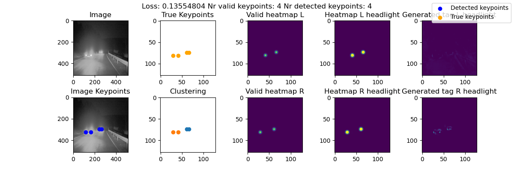
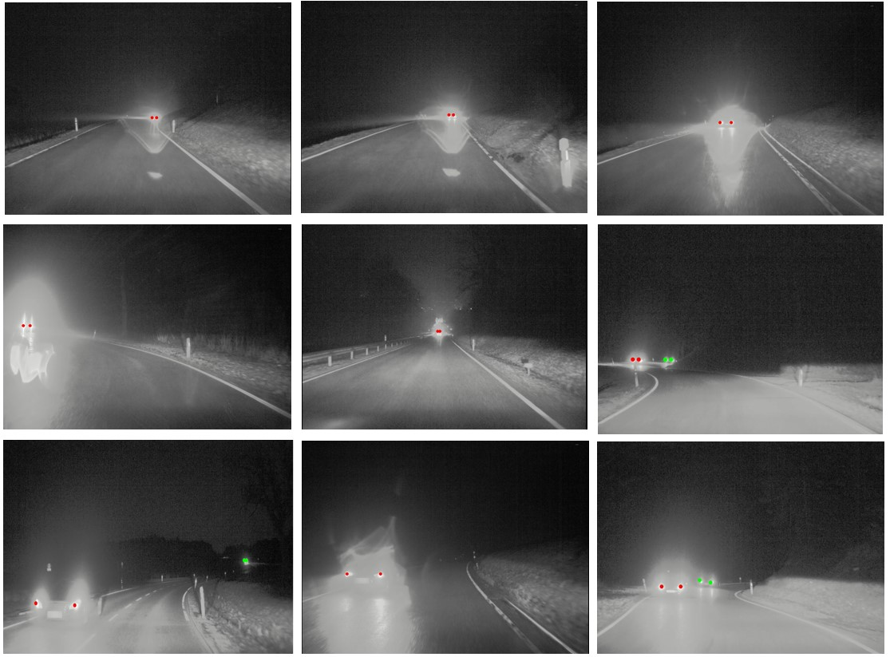
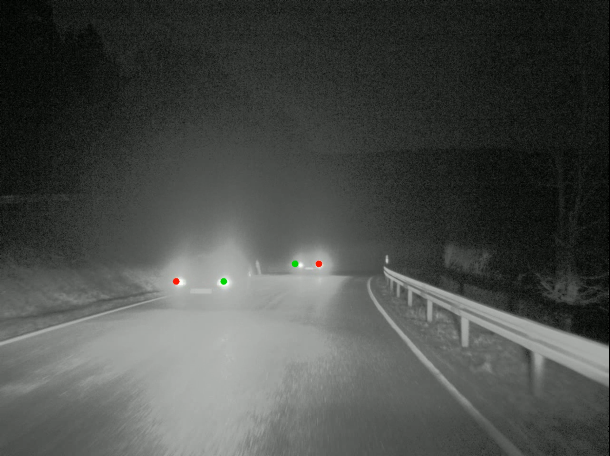

# Headlight Detection at Night With an Embedding Space

This project was developed at Uppsala University HT23 as a part of the course "Project in Software Development in Image Analysis and Machine Learning". The goal of this project is
detect vehicle headlights at night using an embedding space. For more technical information please refer to our [report](./Samples/Project_Repo_Report.pdf).

This project is based on the paper: [Associative Embedding: End-to-End Learning for Joint Detection and Grouping](https://arxiv.org/abs/1611.05424) 


# Installation

* Clone this repository : `git clone --recursive https://github.com/jacobhenningsson95/ADAS_Headlight_Detection`
* Download and install [Anaconda](https://www.anaconda.com/download/) or [Miniconda](https://conda.io/miniconda.html)
* Create a conda environment : `conda env create -f environment.yaml`

## Data

### PVDN

* Download [PVDN dataset](https://www.kaggle.com/datasets/saralajew/provident-vehicle-detection-at-night-pvdn) and extract downloaded zip file (`archive.zip`) to `data/PVDN/`

## Code Structure

* **data**: Dataset path.
	* **PVDN**: Extracted PVDN dataset folder
* **Dataset Cache (Automatically created)**: Stores the pickle files generated by the dataloader. When a part of the dataset is used for the first time a pickle file will be generated.
* **Samples**: Contains output visualizations from the model.
* **Trained Model (Automatically created)**: Folder where trained models will be stored.
* **utils**: Utility code used in different parts of the project.
	* **utils/eval_method.py**: Code for the Gaussian evaluation method.
	* **utils/log_helper.py**: Logging initializer for different parts of the code. 
	* **utils/loss.py**: loss function method and code to adapt the loss calculation for different parts of the code. 
	* **utils/vis_utils.py**:  Initialize and visualize output from the model. Also contains code to parse the model output sucha as thresholding and clustering. 
* **Video Output (Automatically created)**: Stores videos generated by visualization_video.py
* **config.py**: Configuration parameters for the project.
* **dataset.py**: Dataloader for the PVDN dataset. Contains support methods for generating heatmaps and class weights.
* **model.py**: Implementation of the stacked hourglass architecture.
* **test.py**: Tests the model and gives a score based on the Gaussian evaluation method.
* **train.py**: Trains the model based on the stacked hourglass architecture using the train portion of the PVDN dataset.
* **visualization.py**: Visualizes the output of the model given one single image, the output figures contain both ground truths and predictions.
* **visualization_video.py**: Makes predictions on a series of frame and creates a video from those predictions.

## Training

* Activate previously created conda environment : `source activate headlight_detection` or `conda activate headlight_detection`

* run `train.py`.

```
usage: train.py [--cuda CUDA] [--cuda_ordinal CUDA_ORDINAL]
                [--reload RELOAD] [--visualizations VISUALIZATIONS]

optional arguments:
  --cuda CUDA         			Enables CUDA to train on gpu [Default: 'False']
  --cuda_ordinal CUDA_ORDINAL		Specify which CUDA device to use if there are more than one [Default: 0]
  --reload RELOAD     			Specify model name to continue training model. [Default: None]
  --visualizations VISUALIZATIONS   	Enables visualisations during training which can help for debugging, comes at the cost of performance. [Default: 'False'] 
```

As training continues, models are saved to `instance-segmentation-pytorch/Trained Model`. These saved models can continue training using the `--reload` flag.

## Evaluation

After training is completed, we can evaluate the model.

* Activate previously created conda environment : `source activate headlight_detection` or `conda activate headlight_detection`

* Run `test.py`.

```
usage: test.py [--cuda CUDA] [--cuda_ordinal CUDA_ORDINAL]
                [--reload RELOAD] [--visualizations VISUALIZATIONS]
                [--eval_method EVAL_METHOD] [--Gaussian_scalar GAUSSIAN_SCALAR]

optional arguments:
  --cuda CUDA         			Enables CUDA to train on gpu [Default: 'False']
  --cuda_ordinal CUDA_ORDINAL		Specify which CUDA device to use if there are more than one [Default: 0]
  --model_filename MODEL_FILENAME     	Name of the model. The model needs to be in the "Trained Model" folder [Default: None]
  --visualizations VISUALIZATIONS   	Enables visualisations during testing which can help for debugging, comes at the cost of performance. [Default: 'False'] 
  --eval_method EVAL_METHOD   		Choice of evaluation method, in this current implementation there only is the gaussian method. [Default: 'Gaussian'] 
  --Gaussian_scalar GAUSSIAN_SCALAR   	Sets the gaussian scalars that used for the gaussian evaluation method. [Default: [16*16, 32*32, 64*64, 128*128]] 
```

## Visualizations

After training is complete, we can make predictions. We can use `visualizations.py` to make predictions for a single image.

* Activate previously created conda environment : `source activate headlight_detection` or `conda activate headlight_detection`

* Run `visualizations.py`.

```
usage: visualizations.py [--cuda_ordinal CUDA_ORDINAL] [--model_filename MODEL_FILENAME] 
			[--image_name IMAGE_NAME] [--dataset_type DATASET_TYPE]
optional arguments:
  --cuda_ordinal CUDA_ORDINAL		Specify which CUDA device to use if there are more than one [Default: 0]
  --model_filename MODEL_FILENAME     	Name of the model. The model needs to be in the "Trained Model" folder [Default: "model_epoch0.pth"]
  --image_name IMAGE_NAME		Filename of the image to predict [Default: "002580.png"]
  --dataset_type DATASET_TYPE       	Choose the type of dataset to use either train/val or test [Default: "test"]
```

## Video Visualizations

After training is complete, we can make predictions. We can use `visualizations_video.py` to make predictions on a sequence of images to be put together in to a video.

* Activate previously created conda environment : `source activate headlight_detection` or `conda activate headlight_detection`

* Run `visualizations_video.py`.

```
usage: visualizations.py [--cuda_ordinal CUDA_ORDINAL] [--model_filename MODEL_FILENAME] 
			[--sequence_folder SEQUENCE_FOLDER] [--dataset_type DATASET_TYPE]
optional arguments:
  --cuda_ordinal CUDA_ORDINAL		Specify which CUDA device to use if there are more than one [Default: 0]
  --model_filename MODEL_FILENAME     	Name of the model. The model needs to be in the "Trained Model" folder [Default: "model_epoch0.pth"]
  --sequence_folder SEQUENCE_FOLDER	Name of the sequence folder to visualize. If None the whole dataset will be visualized. [Default: "Nonde"]
  --dataset_type DATASET_TYPE       	Choose the type of dataset to use either train/val or test [Default: "test"]
```

## Results

#### Scores on test subset using gaussian evaluation

| σ = 64 | σ = 128 |
|:------:|:-------:|
| 0.863  |  0.937  |

Trained for 100 Epochs.

#### Video Predictions

Video prediction from the Train set. Some issues with the clustering can be observed. 


Video prediction from the Test set, Here again some issues can be observed. 


#### Image Predictions

Example of an output from the visualization tool



Single frame outputs



Example on an unsuccessful clustering



## Conclusions

This project achieves good results in detection but has issues with clustering because of the 1D embedding space.
This was addressed in our work expansion: https://github.com/jacobhenningsson95/ADAS_Headlight_Detection_Expansion